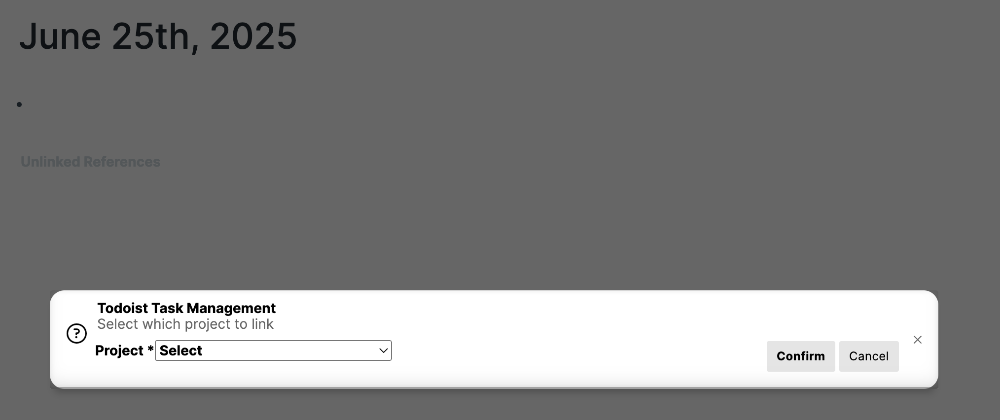

This extension allows you to manage your Todoist tasks from within your Roam Research graph.

**NEW:**
- Fixed: issues with duplicate import of tasks

**Previously:**
- new workflow to connect a project to a page

The Command Palette option to link a project is now 'Link a Todoist project'.
This will trigger a pop-up menu with a select menu that lists all of your projects. Simply select the one you want to link and the extension does the rest.
- Fixed: Issue with completing tasks fixed
- Now compatible with the new user-defined hotkeys function - see Hotkeys option in Roam Research Settings
- Rearranged config settings for easier introduction for new users
- BETA - if using automatic sync, option to parse your DNP for new tasks, subtasks and comments, and then sync them to Todoist.
  - the extension will check the blocks nested under your import heading
  - if there are new children with {{[[TODO]]}} they will be created as new tasks in Todoist
  - if there are new grandchildren (children of existing tasks) - they will be synced to Todoist as comments if they don't have {{[[TODO]]}} and subtasks if they do have {{[[TODO]]}}
  - if you rename the title of any tasks or subtasks, that change will be synced back to Todoist
  - you can also edit comment text and it will sync and update the comment
  - at this stage, you can't delete tasks, subtasks or comments, but you can close and reschedule tasks as before
  - you can't reorder comments, as this is a limitation of Todoist
  - you also can't nest comments, or thread them in any way - again, this is a limitation of Todoist. This extension will ignore great-grandchildren blocks and they will be deleted at the next sync.
  

This version allows:

1. import tasks by automatically sensing the date of a DNP and only bringing relevant tasks, using the Command Palette command 'Import tasks from Todoist'. 
2. you can also import using the SmartBlock command <%IMPORTTODOIST%>. Or create a button to trigger the SmartBlock and have this in your daily template.
3. create tasks within Roam Research and push them to Todoist using a Command Palette command 'Create task in Todoist'
4. complete tasks in Roam by checking the TODO checkbox, and automatically complete the same task in Todoist
5. link a RR project page to a project in Todoist and import, create and complete tasks for that project within Roam. Use the Command Palette command 'Link to Todoist project via clipboard'
6. reschedule tasks by using the Command Palette command Reschedule task(s) in Todoist. A datepicker popover will appear and if you select a new date the task will be rescheduled in Todoist and moved to the correct page in your Roan Research graph.
7. Option to configure whether to Strikethrough a completed task or not to
8. Reschedule multiple tasks as a batch. Use Roam's block multiselect mode (Ctrl-m) to choose which tasks to reschedule, then use the command palette or right-click one of the task's bullets and select Plugins > Reschedule task(s) in Todoist. This will launch a datepicker dialogue and you can choose which date to send them to.

Automatic sync of daily tasks in both directions!
- Set a configurable interval and the extension will update tasks from Todoist automatically to your DNP. If you complete a task in Todoist it should update in your RR graph. You can still complete tasks in Roam Research and have that sync to Todoist, and uncomplete of tasks in RR will also update the task in Todoist. The only limitation is that you can't uncomplete a recurring task as the Todoist API won't allow for that.
- Option to create a link back to the Roam Research block on creating a task in Todoist. Turned off by default. Creates a link to the RR block reference in the description field of the Todoist task.

This video shows most of this in action:

https://www.loom.com/share/eecfe93ec49844ab9ec0f58ee301a75b