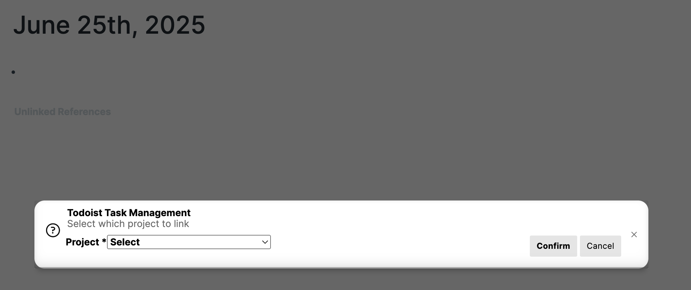

This extension allows you to manage your Todoist tasks from within your Roam Research graph.

**Recent changes:**
- Migrated to the new Todoist API v1
- Added a slash command for creating tasks
- Reorganised settings using progressive disclosure (Intermediate options toggle)
- Various safety and performance improvements

## Features

1. **Import tasks** - automatically detects the date of a DNP and imports relevant tasks. Use the Command Palette command "Import tasks from Todoist", the keyboard shortcut Alt+Shift+I, or the SmartBlock command `<%IMPORTTODOIST%>`.
2. **Create tasks** - create tasks within Roam Research and push them to Todoist. Use the Command Palette command "Create task in Todoist" or the `/Create task in Todoist` slash command.
3. **Complete tasks** - check a TODO checkbox in Roam and the same task is automatically completed in Todoist. Unchecking reopens the task (except recurring tasks).
4. **Link a project** - connect a Roam page to a Todoist project using the Command Palette command "Link a Todoist project". A popup lists all your projects; select one and the extension handles the rest.

5. **Reschedule tasks** - use the Command Palette command "Reschedule task(s) in Todoist" or right-click a task bullet (Plugins menu). A datepicker appears; select a new date and the task is rescheduled in Todoist and moved to the correct page in your graph. Supports batch rescheduling via Roam's block multi-select mode (Ctrl+M).
6. **Automatic sync** - set a configurable interval and the extension updates tasks from Todoist automatically to your DNP. Tasks completed in Todoist update in your graph; tasks completed in Roam sync back to Todoist.

## Settings

Settings use progressive disclosure to keep the panel simple:

- **Todoist API Token** - your token from Todoist Settings > Integrations
- **Roam Research Header** - text header used when importing tasks (default: "Imported tasks")
- **Account type** - enable if subscribed to Todoist Premium
- **Include Overdue** - include overdue tasks alongside today's tasks
- **Show Intermediate options** - toggle to reveal additional settings:
  - Automatic download and interval
  - Include completed tasks / strikethrough completed tasks
  - Import descriptions, subtasks, comments, and priority
  - Create a backlink to the Roam block in new Todoist tasks

## Limitations

- Recurring tasks cannot be un-completed (Todoist API limitation)
- The observer that detects checkbox changes monitors the main panel and right sidebar; very large graphs with frequent DOM mutations may see minor overhead

## Demo

This video shows most features in action:

https://www.loom.com/share/eecfe93ec49844ab9ec0f58ee301a75b
